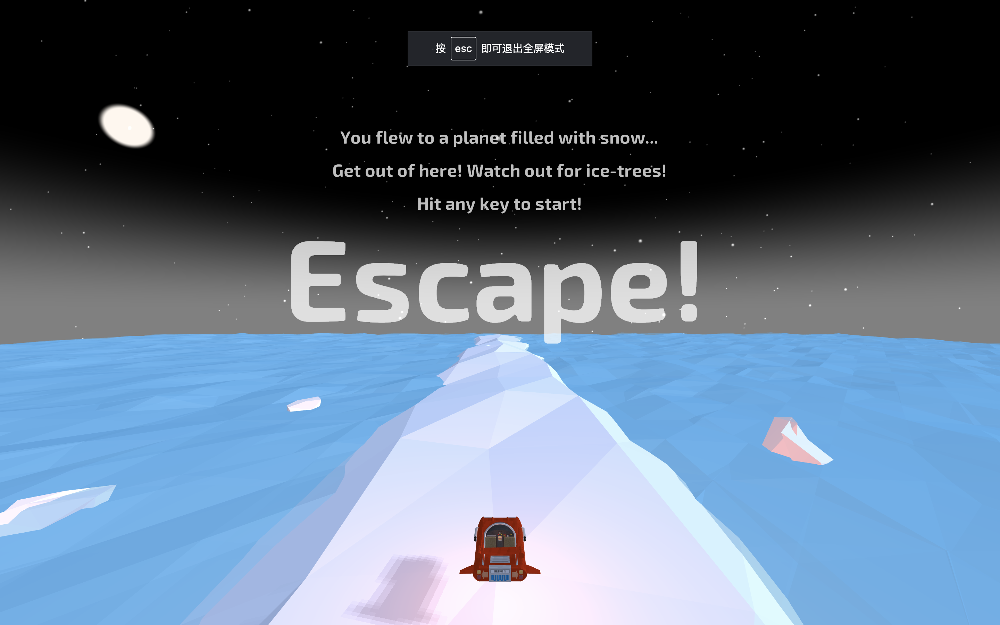
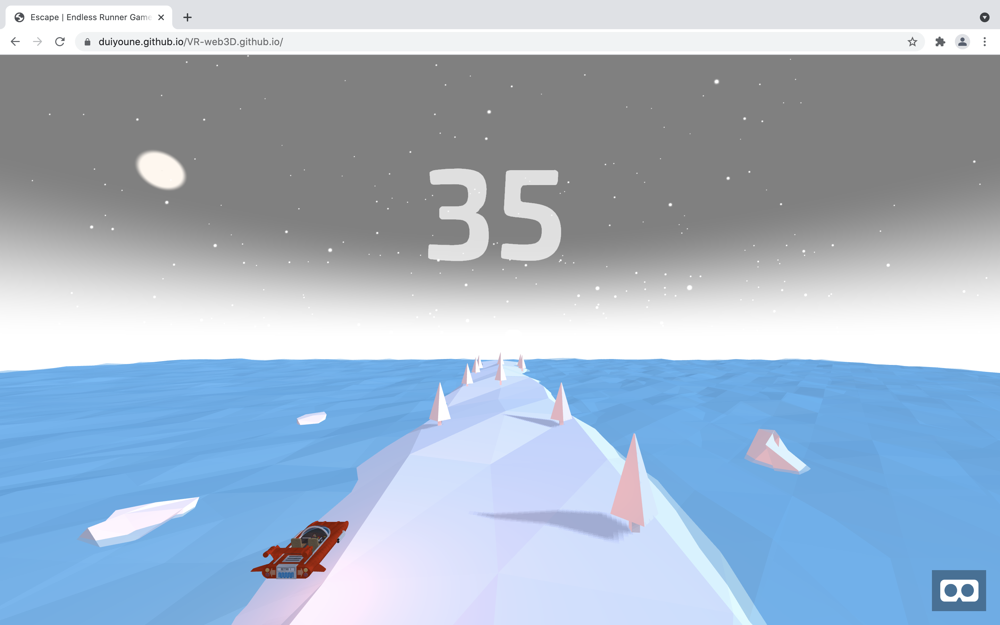
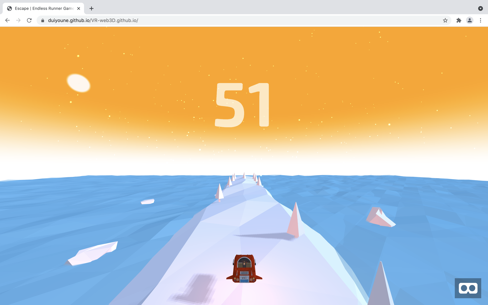
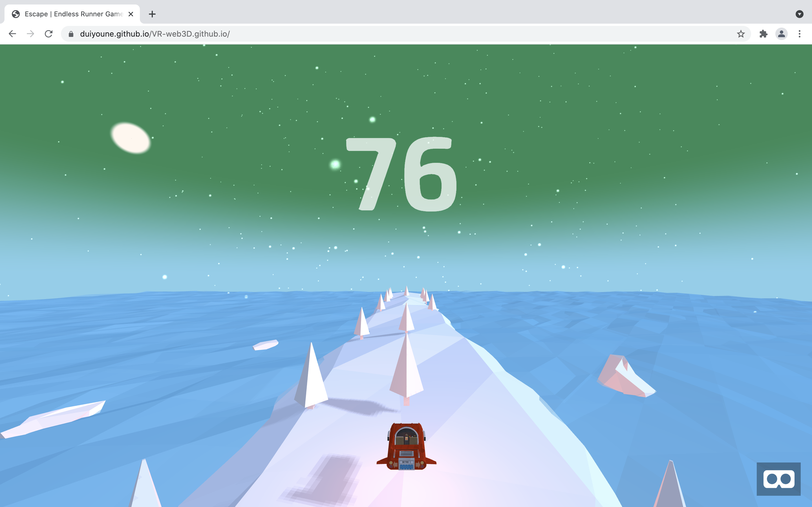
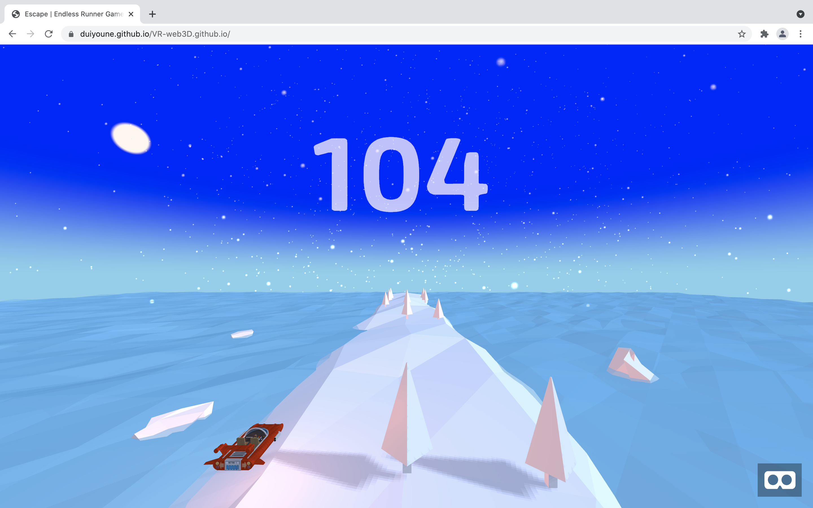
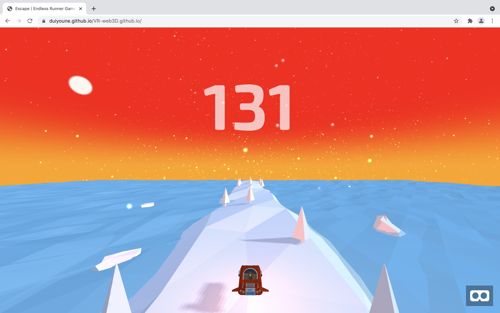
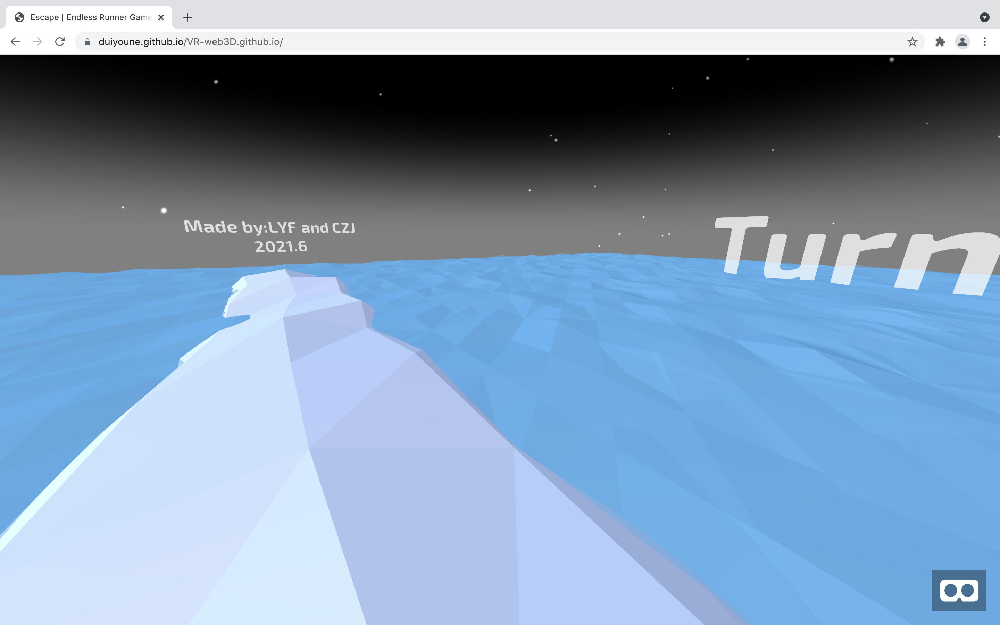
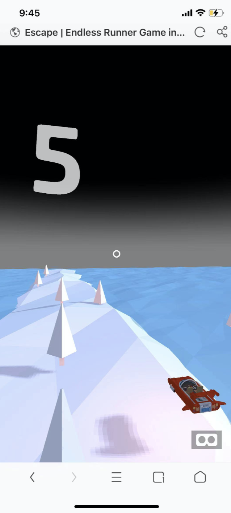
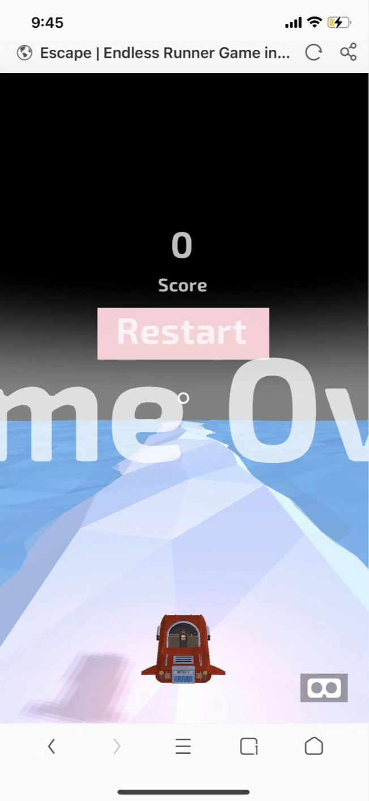

## Report for 3D Runner Game in VR

一般包括用了什么技术、框架，主要工程模块的功能描述，达到的最终结果的简单表述等等。


### 基本介绍

本项目是一个基于Web3D的跑酷类VR游戏。在游戏中，玩家可以操纵小球进行左右移动，并躲避路上的障碍。由于采用了3D框架，玩家可以用鼠标调整视角。在实现过程中，主要采用了a-frame框架来完成3D场景的搭建。

### 框架介绍

AFrame 是一个用来构建虚拟现实（VR）应用的网页开发框架。由WebVR的发起人Mozilla VR 团队所开发，是当下用来开发WebVR内容主流技术方案。WebVR是一个完全开源的项目，已成长为领先的VR社区。

AFrame基于HTML，容易上手。但是A-Frame不仅仅是一个3D场景渲染引擎或者一个标记语言。其核心思想是基于Three.js来提供一个声明式、可扩展以及组件化的编程结构。

AFrame支持主流VR头显如Vive, Rift, Daydream, GearVR,Cardboard, 甚至可被用于增强现实（AR）。虽然A-Frame支持全谱，A-Frame的目标是定义具有位置跟踪和操控的完全身临其境和交互式VR体验，超出基本的360° 内容呈现。

### 功能模块

+ 3D场景搭建

  **天空**：

  游戏中的天空采用Aframe的注册实体[simple-sun-sky](https://github.com/DougReeder/aframe-simple-sun-sky)实现。通过调整sun-position，光线颜色和雾气颜色实现月夜的效果。

  ```html
  <a-simple-sun-sky sun-position="-1 0.5 -1" light-color="black" dark-color="black" fog-color="gray">
  </a-simple-sun-sky>
  ```

  **飘雪**:

  由于飘雪涉及到较为复杂的粒子效果，游戏中的飘雪采用A-frame的注册实体[particlie-system](https://github.com/IdeaSpaceVR/aframe-particle-system-component)实现。

  ```html
  <a-entity position="0 2.25 -15" particle-system="preset: snow; particleCount: 10000"></a-entity>
  ```

  **海洋：**

  由于海洋设计到较为复杂的浮动效果，游戏中的海洋采用A-frame的注册实体[ocean](https://github.com/n5ro/aframe-extras)实现。

  ```html
  <a-ocean depth="50" width="50" amplitude="0" amplitude-variance="0.1" speed="1.5" speed-variance="1" opacity="1" density="50"></a-ocean>
  ```

  **光源**：

  ```html
  <a-entity light="
       type: directional;
       castShadow: true;
       intensity: 0.4;
       color: #D0EAF9;"
       position="5 3 1"></a-entity>
  <a-light intensity="0.8" type="ambient" position="1 1 1" color="#B4C5EC"></a-light>
  ```

  **浮冰**：

  我们的浮冰采用Aframe中的组件实现。通过调整其属性使其具有冰块的形状，并添加了`a-animation`标签实现动画效果。冰块能够上下浮动并左右摇晃。

  ```html
  <lp-cone class="iceberg" segments-radial="5" segments-height="3" height="1" amplitude-variance="0.25" radius-top="0.15" radius-bottom="0.5" position="3 -0.1 -1.5">
    <a-animation attribute="rotation" from="-5 0 0" to="5 0 0" repeat="indefinite" direction="alternate"></a-animation>
    <a-animation attribute="position" from="3 -0.2 -1.5" to="4 -0.2 -2.5" repeat="indefinite" direction="alternate" dur="12000" easing="linear"></a-animation>
  </lp-cone>
  ```

  **障碍物（树木）**：

  我们的树木采用Aframe中的组件实现。通过上下两个实体拼接为树的形状。我们将通过js随机地在赛道中刷新树木。

  ```html
  <a-entity data-tree-position-index="1" id="template-tree-center" class="tree tree-center" shadow scale="0.3 0.3 0.3" position="0 0.6 0">
    <a-entity mixin="foliage" color='#008000'></a-entity>
    <a-entity mixin="trunk" position="0 -0.5 0"></a-entity>
    <a-animation attribute="position" ease="linear" from="0 0.6 -7" to="0 0.6 1.5" dur="5000"></a-animation>
  </a-entity>
  ```

  **玩家飞船：**

  玩家飞船我们采用a-entity读取.gilf格式的三维文件导入场景。我们为玩家的飞船增加了相应的动画，来使得玩家飞船可以上下浮动。同时，我们在玩家飞船中也设置了光源，以实现阴影效果和聚焦效果。

  ```html
  <a-entity id="player" player>
    <a-entity gltf-model = "#car" position="0 0.523 0.2" scale="0.13 0.13 0.13" rotation = "0 180 0">
      <a-animation repeat="indefinite" direction="alternate" attribute="position" ease="ease-in-out" from="0 0.5 0.6" to="0 0.525 0.6"></a-animation>
      <a-animation repeat="indefinite" direction="alternate" attribute="radius" from="0.05" to="0.055" dur="1500"></a-animation>
      <a-light type="point" intensity="0.35" color="#FF440C">
        <a-animation repeat="indefinite" direction="alternate-reverse" attribute="intensity" ease="ease-in-out" from="0.35" to="0.5"></a-animation>
      </a-light>
    </a-entity>
  </a-entity>
  ```

+ 小球控制模块

  本模块负责控制小球的运动。我们可以通过a、d按键或者左右按键来控制小球的左右移动来躲避障碍物。同时，我们实现了在该游戏在手机端的适配。即通过手机旋转角度来判断左右移动。

  

  

+ 障碍物生成模块

  我们通过设定三条赛道，并在赛道上随机生成障碍物的方式来完成地图的设计。这种设计方案可以确保每次运行都能生成不同的地图，提高可玩性。同时，设定障碍物由远及近运动，将玩家与摄像机固定，可以构造出玩家在向前运动的视觉效果。这样的方案可以减少计算量。

  

+ 碰撞检测模块

  当小球与障碍物碰撞时即游戏结束。我们通过检测如下条件：``POSITION_Z_LINE_START < position.z && position.z < POSITION_Z_LINE_END && tree_position_index == player_position_index``来判断小球是否撞上了障碍物。即小球的z轴位置在和障碍物的z轴体积重合，且小球在该障碍物的赛道内，即可完成碰撞判断。相比传统的碰撞检测，这种方式的计算量更小，通过先验知识来降低了程序的运算量，提高响应速度。代码如下：

  

+ 记分板模块

  每越过一个障碍物，记分板就会加一分。当物体撞上障碍物后记分结束，显示Game Over

  

### 游戏运行方式

游戏已经部署到github pages上，可以使用手机浏览器或者PC浏览器直接访问https://duiyoune.github.io/VR-web3D.github.io进行体验（不推荐使用safari)。

### 游戏场景截图















### 手机端适配



